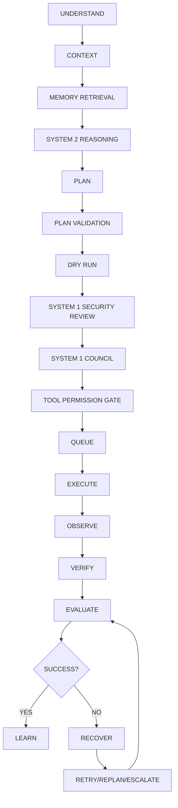
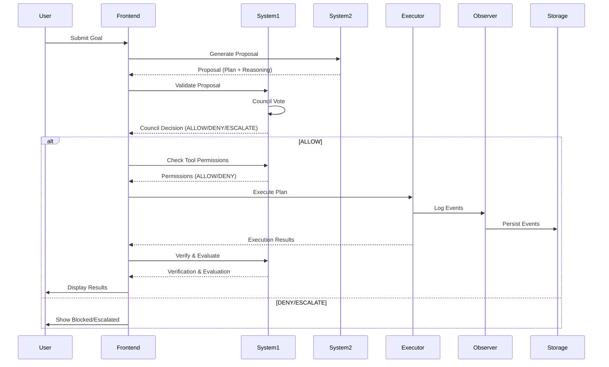

# Agentic-AI V3.2+ Architecture

**Local-First Autonomous AI Operating System**

---

## 🏗️ **Two-Backend Architecture**

Agentic-AI V3.2+ introduces a **strict separation** between **System 1 (Authority Plane)** and **System 2 (Intelligence Plane)** to ensure security, control, and autonomy.

### **🔹 System 1 — Authority / Control Plane**
- **Role**: Permanent authoritative backend.
- **Port**: `127.0.0.1:8101`
- **Responsibilities**:
  - Security
  - Permissions
  - Policy enforcement
  - Tool authorization
  - Execution approval
  - Task lifecycle management
  - Runtime supervision
  - Recovery
  - Audit logging
  - Model governance
  - System 2 governance
  - Failure handling
  - Emergency protection
  - Provider management
  - Resource management

**⚠️ System 1 Rules:**
- **Always-on**: Cannot be stopped by System 2 or frontend.
- **Authoritative**: All decisions are final.
- **Immutable**: System 2 cannot modify System 1.
- **Secure**: All security violations are audited.

---

### **🧠 System 2 — Intelligence / Reasoning Plane**
- **Role**: Local reasoning backend.
- **Port**: `127.0.0.1:8102`
- **Responsibilities**:
  - Understand user goals
  - Analyze context
  - Retrieve memory
  - Reason
  - Generate plans
  - Suggest actions
  - Generate tool parameters
  - Evaluate possible approaches
  - Propose recovery strategies
  - Learn from results

**⚠️ System 2 Rules:**
- **Loopback-only**: Only `127.0.0.1`, `localhost`, or `::1` endpoints are allowed.
- **Non-authoritative**: Cannot authorize execution or modify System 1.
- **Replaceable**: Can be restarted, updated, or replaced without affecting System 1.
- **Local-first**: Must run locally (no remote fallback).

---

## 🔄 **Core Agent Loop**

The agent follows a **strict lifecycle** with **System 1 validation at every step**:



**Key Principles:**
- **Every transition is logged** (audit trail).
- **System 2 can propose, but System 1 must approve**.
- **No execution without Council + Tool Permission approval**.

---

## 🗂️ **Project Structure**

```
Agentic-AI/
│
├── backend/
│   ├── app/
│   │   ├── main.py               # Main backend (port 8000)
│   │   ├── agent.py              # Agent Kernel
│   │   ├── executor.py           # Execution runtime
│   │   ├── planner.py            # DAG-based planning
│   │   ├── observer.py           # Event logging
│   │   ├── verifier.py           # Verification
│   │   ├── evaluator.py          # Evaluation
│   │   ├── memory.py             # Memory system
│   │   ├── storage.py            # SQLite storage
│   │   ├── tool_registry.py      # Tool permissions
│   │   ├── system1_council.py   # Council voting logic
│   │   ├── runtime.py            # Runtime queue
│   │   ├── recovery.py           # Recovery system
│   │   └── ...
│   │
│   ├── system1/
│   │   ├── server.py            # System 1 backend (port 8101)
│   │   ├── service.py            # System 1 service (Council, Providers, Audit)
│   │   └── __init__.py
│   │
│   ├── system2/
│   │   ├── server.py            # System 2 backend (port 8102)
│   │   ├── service.py            # System 2 service (Local Models, Proposals)
│   │   └── __init__.py
│   │
│   ├── run_backends.py          # Start all backends
│   └── requirements.txt
│
├── frontend/
│   ├── src/
│   │   ├── main.tsx             # Main App (React + TypeScript)
│   │   ├── components.tsx       # Reusable UI components
│   │   ├── pages/
│   │   │   ├── System1.tsx       # System 1 Authority Page
│   │   │   ├── System2.tsx       # System 2 Intelligence Page
│   │   │   ├── Council.tsx       # Council Voting Page
│   │   │   └── ...
│   │   ├── style.css            # Global styles
│   │   └── ...
│   └── package.json
│
├── .github/
│   └── workflows/
│       └── ci.yml               # GitHub Actions CI
│
├── README.md
├── ARCHITECTURE.md              # This file
├── API.md                      # API Documentation
├── SECURITY.md                 # Security Rules
├── RUNTIME.md                  # Runtime Configuration
└── V3.2_IMPLEMENTATION.md      # V3.2 Progress Tracker
```

---

## 🔌 **Backend Services**

| **Service**       | **Port**      | **Role**                          | **Authority** | **Loopback-Only** |
|------------------|--------------|----------------------------------|--------------|------------------|
| **Main Backend** | `8000`       | API Gateway, Task Management     | ❌ No        | ❌ No            |
| **System 1**     | `8101`       | Authority, Council, Security      | ✅ Yes       | ✅ Yes           |
| **System 2**     | `8102`       | Local Reasoning, Proposals       | ❌ No        | ✅ Yes           |

---

## 🛡️ **Security Architecture**

### **🔒 System 1 Authority Rules**
1. **System 1 is always authoritative** (cannot be overridden).
2. **System 2 can never authorize execution** (only propose).
3. **System 2 cannot modify System 1** (no writes to System 1).
4. **System 2 cannot stop System 1** (no `/stop` endpoint).
5. **System 2 cannot bypass the Council** (all executions require Council approval).
6. **Tool permissions are mandatory** (no execution without `ALLOW`).
7. **Critical tools are blocked by default** (e.g., shell, filesystem).
8. **Unknown actions fail closed** (default: `DENY`).
9. **Remote System 2 fallback is forbidden** (only loopback).
10. **All security violations are audited** (logged in System 1).

### **🔐 System 2 Restrictions**
- **Loopback-only**: Only `127.0.0.1`, `localhost`, `::1` allowed.
- **No remote endpoints**: Public IPs, domains, and `https` are rejected.
- **No authority**: Cannot authorize, execute, or modify System 1.
- **Replaceable**: Can be restarted, updated, or replaced safely.

---

## 🤖 **Agent Kernel**

The **Agent Kernel** (`backend/app/agent.py`) manages the **complete agent lifecycle**:

### **AgentRun Structure**
```python
{
    "run_id": str,
    "task_id": str,
    "goal": str,
    "status": str,  # created, planned, running, observing, verifying, evaluating, retrying, replanning, completed, failed, escalated, cancelled
    "phase": str,
    "iteration": int,
    "max_iterations": int,
    "retry_count": int,
    "max_retries": int,
    "confidence": float,
    "confidence_threshold": float,
    "created_at": str,
    "started_at": str,
    "updated_at": str,
    "completed_at": str,
    "model": str,
    "system2_proposal": dict,
    "plan": dict,
    "council_decisions": list,
    "tool_permissions": list,
    "events": list,
    "result": Any,
    "error": Any,
    "recovery_state": str,
}
```

---

## 📡 **Frontend-Backend Communication**

### **Transport**
- **Primary**: Server-Sent Events (SSE) via `/api/observability/events`
- **Fallback**: Polling (for compatibility)
- **Optional**: WebSocket via `/api/runtime/ws`

### **Frontend Pages**
| **Page**         | **Description**                                      | **Backend Dependency** |
|------------------|------------------------------------------------------|-----------------------|
| **Dashboard**    | Overview of System 1/2, tasks, metrics               | Main Backend          |
| **Agent**        | Live execution observatory                           | Main Backend          |
| **System 1**     | Authority, Council, Providers, Audit                 | System 1 (`8101`)     |
| **System 2**     | Local models, proposals, status                      | System 2 (`8102`)     |
| **Council**      | Voting interface for Council decisions               | System 1 (`8101`)     |
| **Tasks**        | Task history and audit                               | Main Backend          |
| **Memory**       | Memory search and recall                             | Main Backend          |
| **Evaluations**  | Evaluation history and scores                        | Main Backend          |
| **Tools**        | Tool registry and permissions                        | Main Backend          |
| **Logs**         | System logs and events                               | Main Backend          |
| **Settings**     | Configuration for System 1/2, Runtime, Security      | Main Backend          |

---

## 🔧 **Key Components**

### **1. Council**
- **Modes**: `Any` (1 approval), `All` (all must approve), `Consensus` (majority)
- **Voting**: `ALLOW`, `DENY`, `ESCALATE`
- **Fail-Closed**: If disagreement, default to `DENY`

### **2. Tool Permission Gate**
- **Risk Levels**: `SAFE`, `LOW`, `MEDIUM`, `HIGH`, `CRITICAL`
- **Policies**: `AUTO`, `CONFIRM`, `DENY`
- **Default**: `CRITICAL` tools are `DENY` by default

### **3. Recovery System**
- **Persistent Queue**: Jobs stored in SQLite
- **Recoverable States**: `queued`, `running`, `observing`, `verifying`, `evaluating`, `retrying`, `replanning`
- **Recovery API**: `/api/recovery/status`, `/api/recovery/requeue/{run_id}`

### **4. Event Bus**
- **Centralized**: All runtime events emitted via `EventBus`
- **Events**: `task_created`, `plan_created`, `system2_proposal`, `council_decision`, `permission_granted`, `execution_started`, etc.

### **5. Observability**
- **SSE**: `/api/observability/events` (primary)
- **WebSocket**: `/api/runtime/ws` (optional)
- **Metrics**: Tasks, runs, latency, errors, Council decisions

---

## 📊 **Data Flow**



---

## 🚀 **Startup**

### **Backend**
```bash
# Start all backends (System 1, System 2, Main)
cd backend
python run_backends.py

# Or start individually:
python -m uvicorn backend.system1.server:app --host 127.0.0.1 --port 8101
python -m uvicorn backend.system2.server:app --host 127.0.0.1 --port 8102
python -m uvicorn backend.app.main:app --host 127.0.0.1 --port 8000
```

### **Frontend**
```bash
cd frontend
npm install
npm run dev
```

### **Access**
- **Frontend**: [http://127.0.0.1:5173](http://127.0.0.1:5173)
- **Main Backend**: [http://127.0.0.1:8000](http://127.0.0.1:8000)
- **System 1**: [http://127.0.0.1:8101](http://127.0.0.1:8101)
- **System 2**: [http://127.0.0.1:8102](http://127.0.0.1:8102)

---

## 🔍 **Key Files**

| **File**                          | **Purpose**                                      |
|----------------------------------|--------------------------------------------------|
| `backend/system1/server.py`      | System 1 Authority Backend (port 8101)           |
| `backend/system1/service.py`     | System 1 Service (Council, Providers, Audit)      |
| `backend/system2/server.py`      | System 2 Intelligence Backend (port 8102)        |
| `backend/system2/service.py`     | System 2 Service (Local Models, Proposals)       |
| `backend/app/main.py`            | Main Backend (port 8000)                          |
| `backend/app/agent.py`           | Agent Kernel (Execution Lifecycle)                |
| `backend/app/planner.py`         | DAG-based Planner                                |
| `backend/app/executor.py`        | Execution Runtime                                |
| `backend/app/observer.py`        | Event Logging                                    |
| `backend/app/recovery.py`        | Recovery System                                  |
| `frontend/src/main.tsx`         | Frontend App (React + TypeScript)               |
| `frontend/src/pages/System1.tsx`| System 1 Authority Page                          |
| `frontend/src/pages/System2.tsx`| System 2 Intelligence Page                        |
| `frontend/src/pages/Council.tsx`| Council Voting Page                              |

---

## 📜 **API Documentation**

See **[API.md](API.md)** for detailed endpoint documentation.

---

## 🔒 **Security Rules**

See **[SECURITY.md](SECURITY.md)** for security policies and restrictions.

---

## ⚡ **Performance & Scalability**

- **Lightweight**: Designed for local execution (no cloud dependency).
- **Asynchronous**: Non-blocking API with `asyncio`.
- **Efficient Storage**: SQLite for persistence.
- **Bounded Queue**: Prevents memory overload.
- **Low Latency**: SSE for real-time updates.

---

## 🎯 **V3.2 Completion Criteria**

The project is **complete** when:

### **Backend**
- [ ] System 1 runs independently on `127.0.0.1:8101`
- [ ] System 2 runs on `127.0.0.1:8102` (loopback-only)
- [ ] Council voting works (`ALLOW`/`DENY`/`ESCALATE`)
- [ ] Persistent job queue with recovery
- [ ] Dry-run engine with frontend visualization
- [ ] EventBus emits all runtime events
- [ ] All APIs documented in `API.md`

### **Frontend**
- [ ] Dashboard with System 1/2 health, live metrics
- [ ] Agent page with System 2 proposal, Council votes
- [ ] System 1 page (authority, providers, audit)
- [ ] System 2 page (models, status, controls)
- [ ] Council page (voting interface)
- [ ] All pages responsive and accessible

### **Security**
- [ ] System 2 cannot stop/modify System 1
- [ ] Council cannot be bypassed
- [ ] Tool permissions cannot be bypassed
- [ ] Critical operations fail closed
- [ ] All violations are audited

### **Documentation**
- [ ] `ARCHITECTURE.md` (this file)
- [ ] `API.md`
- [ ] `SECURITY.md`
- [ ] `RUNTIME.md`
- [ ] `V3.2_IMPLEMENTATION.md`

---

## 📚 **Further Reading**

- **[README.md](README.md)** – Project overview and setup
- **[API.md](API.md)** – API endpoint documentation
- **[SECURITY.md](SECURITY.md)** – Security policies and rules
- **[RUNTIME.md](RUNTIME.md)** – Runtime configuration and queue management
- **[V3.2_IMPLEMENTATION.md](V3.2_IMPLEMENTATION.md)** – V3.2 progress tracker
